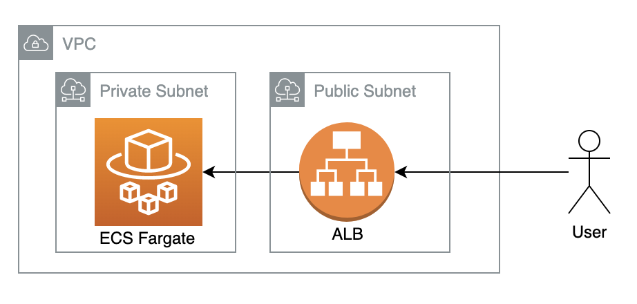

# Flask App run on AWS Fargate
This application is running on AWS Fargate with cpu autoscaling behind a load balancer across multiple availaibitly zones.

### Building the application and pushing to a docker registry
1. If needed change the REGISTRY and TAG variables in `scripts/build_and_push.sh`
2. Run the script to build and push the image:
```
./scripts/build_and_push.sh
```

### Infra Deployment (This works on a fresh or existing aws account)
1. Set up aws credentials.
2. Move to the terraform directory.
3. Update the `backend.tf` file to the desired/bucket/region key (User must have write access to this bucket).
3. If desired (or no credentials for default registry) please create a tfvars file similiar to: `test.tfvars`
4. Initialize the terraform state
```
terraform init
```
5. Run the apply command (tfvars only if you created in step 3). This stepp will take about 3-4 minutes depending on the region.
```
terraform apply -var-file=<var_file_name>.tfvars
```
6. In the terraform outputs there will be a publicly accessible url. Use this to access your application. (Health checks for the container will take a couple of minutes)

### Deploying with application changes (CI/CD)
1. If needed change the REGISTRY and TAG variables in `scripts/build_and_deploy.sh`
2. Run the script to build and deploy a new image: 
```
./scripts/build_and_deploy.sh
```

### Infrastructure Diagram



### Notes/Assumptions
1. VPC config would not typically be in this repo.
2. Latest tag is only used for simplicity and times sake, best practice would be to have versioning in place.
3. A custom domain name, along with SSL should also be used with the ALB.
4. A CI/CD tool like Jenkins would typically be used for building and deploying changes.
